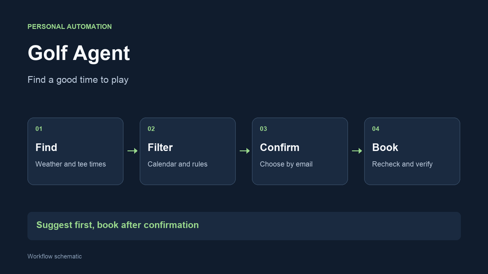

I built Golf Agent to coordinate the checks involved in planning a round: suitable
weather, available tee times and space in the calendar. It sends suggestions and uses an
explicit reply to decide which time to book.

## Try the workflow



## Workflow

## The problem

A free tee time is only useful if the weather is suitable and I can actually
play. Availability can also change between receiving a suggestion and deciding
to book it.

## How it works

- Combine weather forecasts with available tee times
- Filter suggestions using time preferences and calendar availability
- Send a readable proposal and wait for a confirmed choice
- Recheck availability before attempting the booking and verify the result

## A decision that mattered

**Treat booking as a separate step from suggesting.** A proposal does not
reserve anything. The reply needs to contain a confirmed day and time, and
the booking step checks whether that time is still available.

Processed replies are recorded to reduce the risk of repeating a booking.
The workflow also handles cases where a proposed time has been taken by
offering alternatives. Calendar access and the booking service remain
dependencies.

## Built with

Python, weather data, browser automation, macOS calendar integration and
email replies. I built and refined the workflow with AI assistance.

The existing [weather project](/vaerdata/) explores the related data and
forecasting side.
