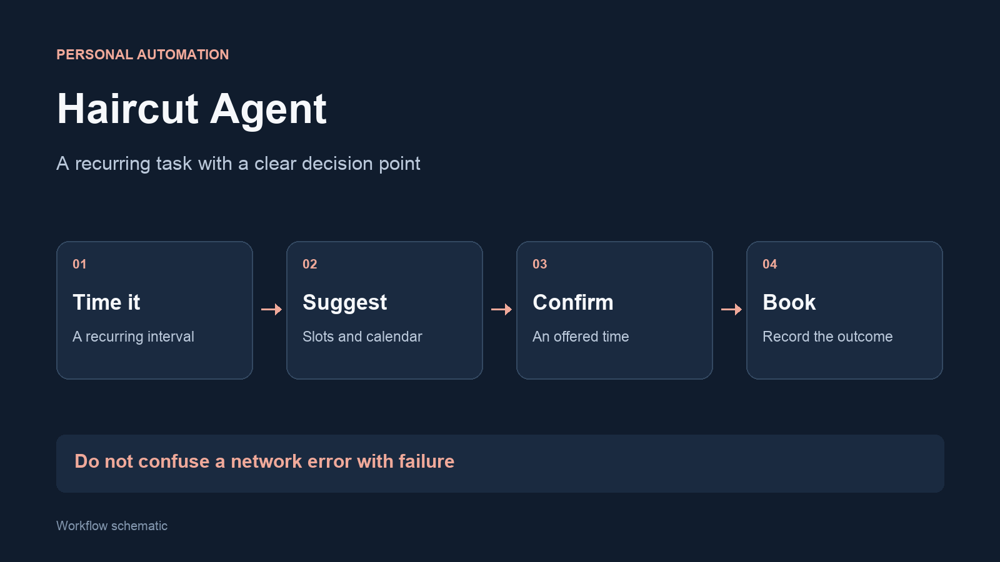

I built Haircut Agent to handle the routine around arranging a recurring appointment. It
checks when a new appointment is due, finds suitable available times and waits for a
confirmed choice before booking.

## Try the workflow



## Workflow

## The problem

Recurring appointments are easy to postpone. Automating the reminder is
straightforward; coordinating availability, a calendar and a booking result
requires a more careful workflow.

## How it works

- Use the previous appointment and a configurable interval to decide when to check
- Find available slots and compare them with time preferences and calendar availability
- Limit repeated suggestions and require a reply selecting an offered time
- Record the booking outcome and attempt to add a calendar event

## A decision that mattered

**Handle an uncertain booking differently from a failed booking.** If the
network drops after a booking request has been sent, the appointment may
already exist. The workflow asks for a manual check instead of treating that
uncertainty as permission to book again.

Another important detail is recording a completed availability check only
after the request succeeds. Otherwise, a temporary network failure could
incorrectly delay the next useful attempt.

## Built with

Python, an appointment API, email replies, local state and macOS calendar
integration. I developed it with AI assistance, using the same
proposal-and-confirmation pattern as [Golf Agent](/projects/golf-agent/).
