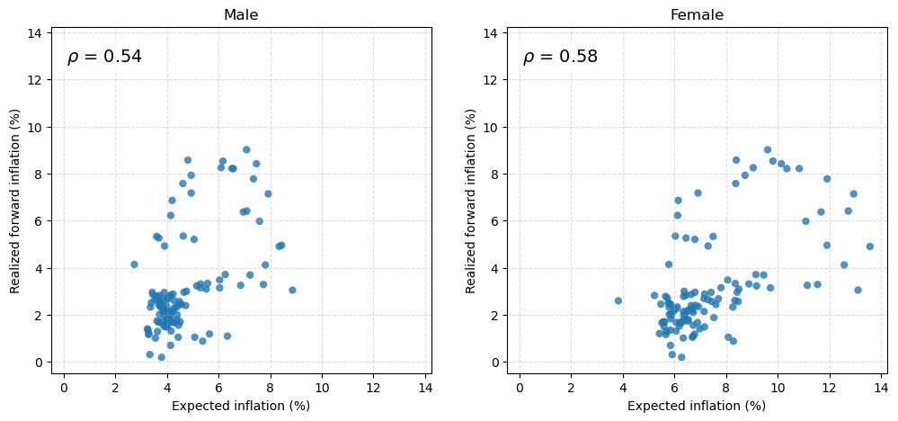

Olav Lidal, Kai Thomas and I used data from the Survey of Consumer Expectations
for a Tech2 coursework project. We compared responses across gender, education
and numeracy and examined their relationship with realised inflation.

## The working notebook

The published notebook contains the code, commentary and saved figures. It can
also be downloaded. This is exploratory coursework; the comparisons and
correlations should be read with the method and source data.

[Explore the original notebook](/blog/tech2_term_paper/).
