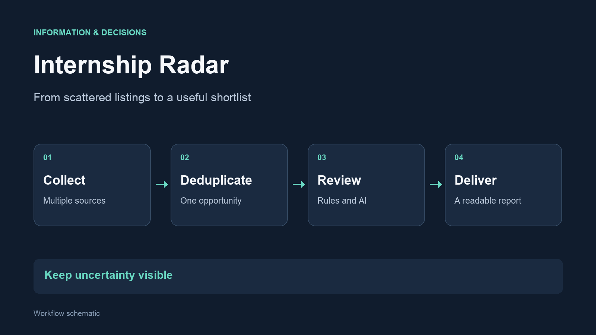

I built Internship Radar to bring opportunities from different job boards and company
websites into one workflow. The project combines data collection, matching rules, an
additional AI review pass and delivery of a readable report.

## The problem

Relevant opportunities can appear under inconsistent company names, unusual
titles or different eligibility descriptions. The same listing can also appear
on several platforms. A useful system needs to handle these differences and
make uncertain matches visible.

## How it works

- Collect listings and retain their original source links
- Identify duplicates and separate new opportunities from previously seen ones
- Apply matching rules, with a separate AI review pass for broader coverage
- Present relevant listings and supporting details in a report

## A decision that mattered

**Separate collection from delivery.** The report is prepared before it is
sent. Listings are marked as seen only after delivery succeeds, so a failed
email does not make an opportunity disappear from the next attempt.

The AI review also needs a visible failure path. If a response cannot be
validated, candidates are retained for review rather than silently discarded.
This is a design choice, not a claim of perfect matching accuracy.

## Built with

Python, web data collection, structured data, rule-based matching,
AI-assisted review and email delivery. I developed and iterated the workflow
with AI assistance.

[Vaktmester](/projects/vaktmester/) provides the broader monitoring layer for
my automations.
