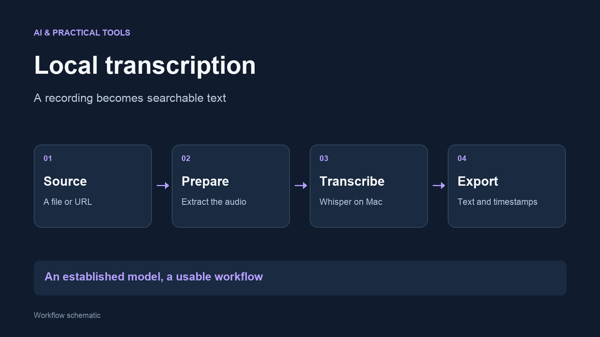

I built a local transcription workflow for Norwegian and English recordings. It accepts
a media file or a supported URL, prepares the audio and exports text with timestamps.
Whisper supplies the speech recognition; my project is the workflow around it.

## The problem

A podcast, recording or video can contain useful information without a
searchable transcript. Manually moving between download tools, audio formats
and transcription software adds friction.

## How it works

- Accept a local media file or download supported media from a URL
- Extract and normalise audio with ffmpeg
- Run mlx-whisper on the Mac
- Save a timestamped Markdown transcript and structured segment data

## A decision that mattered

**Keep the output reusable.** A readable transcript is useful for reviewing the
recording, while structured segments preserve timestamps for later processing.
The workflow can be used with different projects without changing the
transcription engine.

Names and technical terms still need checking, and the tool does not identify
individual speakers. Those limits matter when turning a transcript into notes
or quotations.

## Built with

Python, mlx-whisper, yt-dlp and ffmpeg. I integrated the tools into a repeatable
workflow with AI-assisted development.
