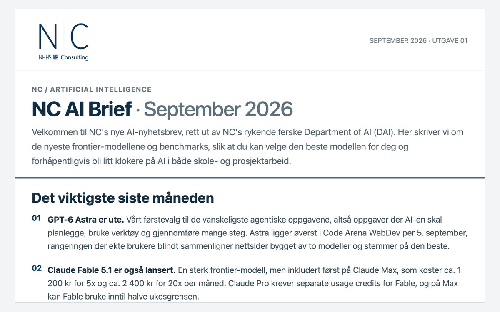

I developed NC AI Brief as a practical publication for NHHS Consulting. The
editorial idea is a monthly overview of relevant changes in AI, explained in
terms of how people can use them in study and project work.

[Read the published September 2026 issue](https://www.nhhsconsulting.no/ai/nyhetsbrev/september-2026).
The issue reflects the information available at its publication date.

## The problem

AI tools and their capabilities change quickly. A reader needs help deciding
which developments matter, what to try and which claims need qualification.

## My contribution

- Research and source checking for the issue
- Selecting developments relevant to students and practical project work
- Turning technical material into explanations and recommendations
- Preparing the issue for web publication and refining mobile reading

The publication was developed with AI assistance. My role is to choose the
questions, review the evidence and shape the final material for its readers.

## A decision that mattered

**Make the sources and the publication date part of the product.** Comparisons,
features and prices can change after an issue is published. A dated edition
gives the reader context for its claims and links to the underlying material.

## Explore the publication

The [public launch article](https://www.nhhsconsulting.no/post/nc-ai-brief-forste-utgave/)
introduces the first issue. The [NC AI hub](https://www.nhhsconsulting.no/ai/)
collects the publication and related resources.

The publishing infrastructure is described in the
[NHHS Consulting website project](/projects/nhhs-consulting/).
