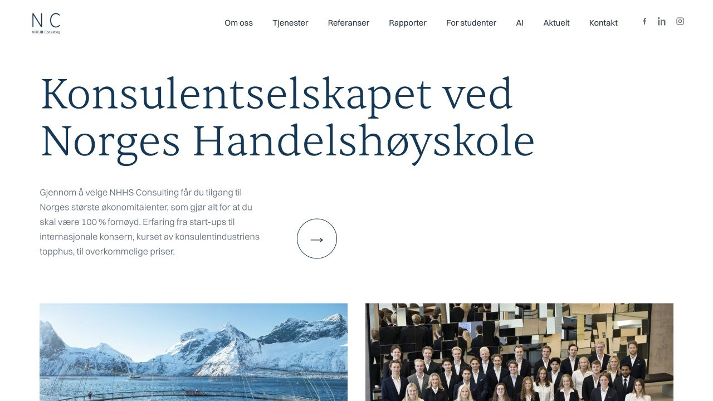

I rebuilt NHHS Consulting's website and publishing setup with AI-assisted
development. The project covered the public site, migration from Wix and a
workflow that future teams can maintain.

## The problem

A student consultancy needs to present its work clearly and keep its website
current as people and responsibilities change. The site also needs a practical
way to publish new content and hand over responsibility.

## What I built

- A Hugo website presenting the consultancy, its services, people and articles
- A browser-based editor using Decap CMS, so contributors can publish without
  editing source files
- An automated build and deployment workflow using GitHub Actions and
  Cloudflare Pages
- Operating documentation for routine updates and the next person maintaining
  the site
- Monitoring scripts that check DNS and public pages after deployment

## The decisions behind the project

**Separate content from presentation.** Pages, articles and team information
live in structured files, while shared templates control their presentation.

**Make routine publishing accessible.** A contributor can use the browser
editor; the build and deployment pipeline handles publishing the changes.

**Plan for handover.** The publishing workflow and operating guide are part
of the deliverable, alongside the website itself.

## Monitoring after launch

The project also includes NC-vakt, a set of checks for DNS and the public site.
It distinguishes a failed check from an inability to perform a check and limits
repeated alerts. This makes ongoing operation part of the website project.

## Explore the result

[Visit NHHS Consulting](https://www.nhhsconsulting.no/), browse the
[public articles](https://www.nhhsconsulting.no/blogg/), or see the
[team presentation](https://www.nhhsconsulting.no/om-oss/).
