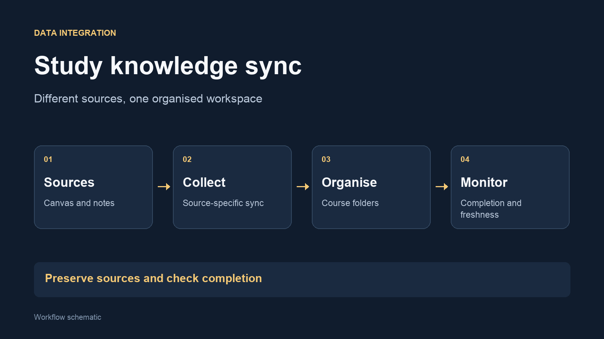

I built a set of sync workflows to bring course material and my own notes into a local
knowledge base. Canvas, OneNote and GoodNotes need different collection methods, but
their outputs are organised around the same course structure.

## The problem

Course files, announcements, typed notes and handwritten notes live in
different applications. Finding the right material is harder when each
application has its own structure and export process.

## How it works

- Collect course files, assignments and announcements from Canvas
- Export my own OneNote notes into local Markdown
- Mirror GoodNotes material into local text and PDF outputs
- Organise outputs by course and monitor successful completion

## A decision that mattered

**Keep synced sources separate from derived work.** A future sync can replace
its own output, so explanations, study aids and other derived material need
their own location. This keeps a useful export from becoming a fragile manual
copy.

Completion records also matter. A fresh log timestamp alone does not prove
that the expected notes or course files were collected.

## Built with

Python, browser-based collection, local file processing and
[Vaktmester](/projects/vaktmester/) monitoring. I developed the integration
with AI assistance. Course material and personal notes remain private.
