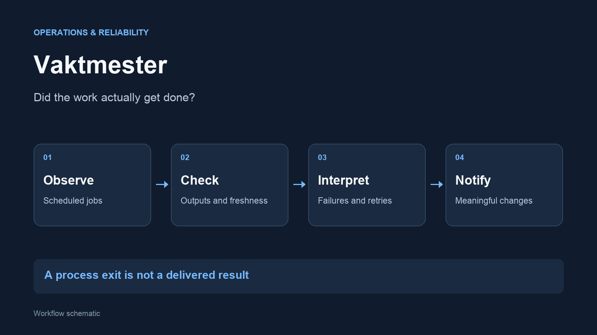

I built Vaktmester as the monitoring layer for my personal automations. Its purpose is
to tell the difference between a job that started, a job that finished and a job that
actually delivered the expected result.

## The problem

Scheduled scripts can fail quietly. A process may return successfully while
its data is stale or its output was never delivered. Repeated alerts can make
the monitoring itself easy to ignore.

## How it works

- Check scheduled jobs, their recent runs and relevant failure signals
- Inspect completion records and output freshness where an exit code is insufficient
- Account for retry windows and temporary network failures
- Group and suppress repeated alerts so new problems remain visible

## A decision that mattered

**Define success for each workflow.** A delivered publication, a completed sync
and a background checker do not have the same success condition. The monitor
uses checks suited to each job rather than treating every log file alike.

The wider tooling also records execution time and model usage. This helps me
investigate how the system behaves without turning an old run into a claim
about current uptime.

## Built with

Python, macOS scheduling, structured state files and email alerts. The monitor
was developed and iterated with AI assistance.

Related projects: [Internship Radar](/projects/internship-radar/) and
[study knowledge sync](/projects/study-sync/).
